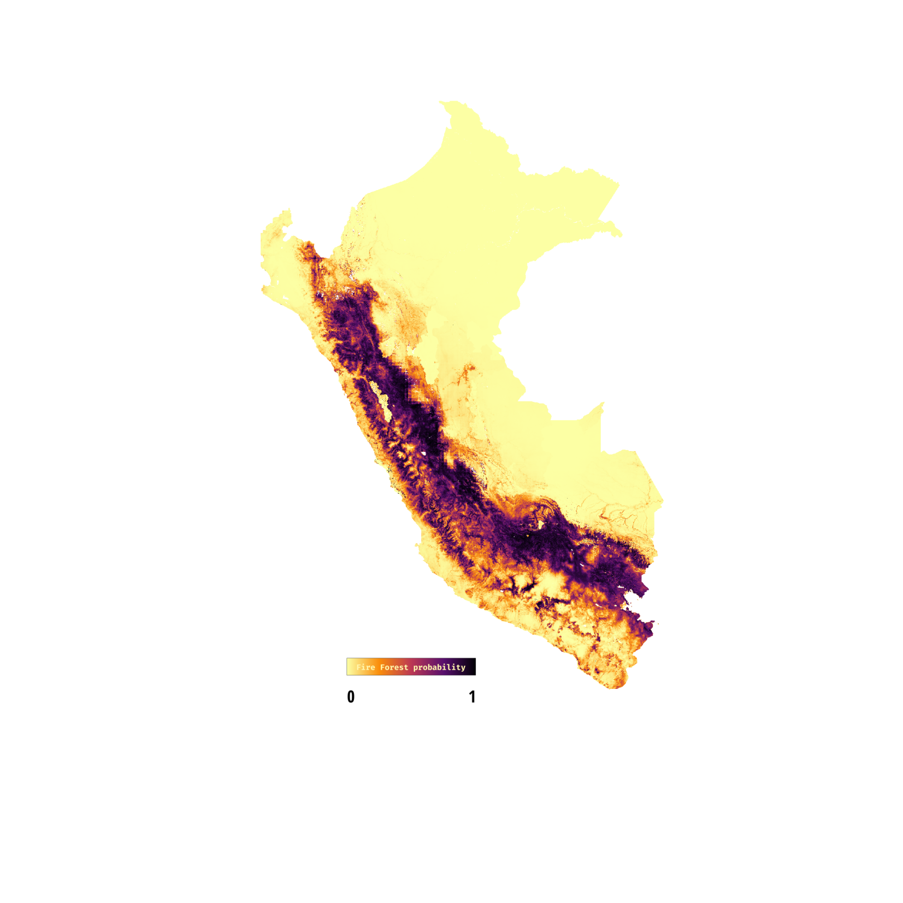

<h4 align="center" style = "font-family:Open Sans;font-weight: bold;">
Hi, my name is Antony, I'm a freelance engineer geographer from Peru with a focus on spatial data science and a lover of free software and open source for geospatial.
</h4>

 
     

 
 
 

<h4>
 

</h4>